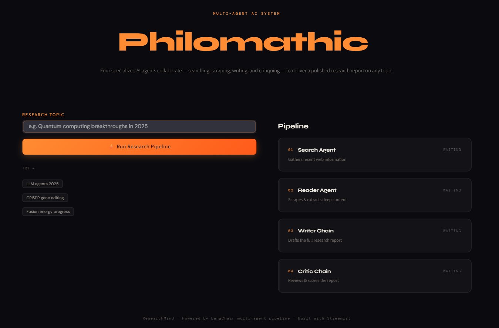
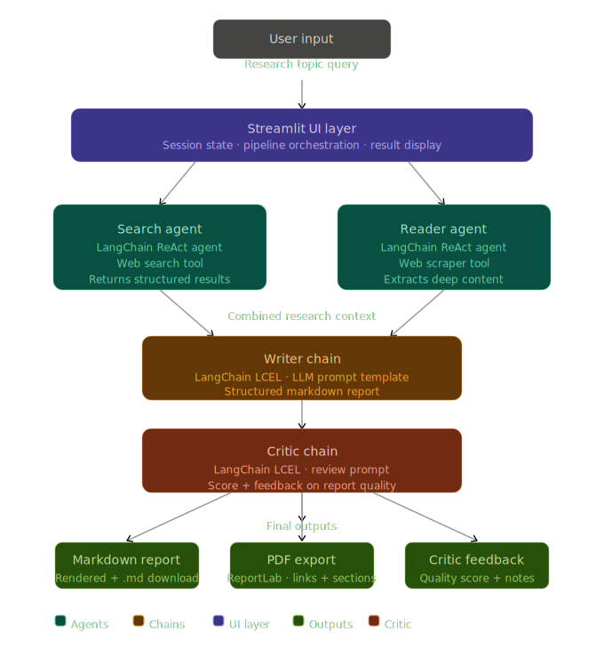

# Philomathic: An Autonomous Multi-Agent Research Engine
AI-powered autonomous research pipeline using specialized agents to gather, synthesize, and critique information.
**Topic Input → Web Search → Deep Scraping → Report Generation → Expert Critique**

[🚀 Live App](https://philomathic.streamlit.app/)


---

## 📸 Demo

*Modern, dark-themed UI built with Streamlit for a premium research experience.*

---

## 🧠 What This Project Does
Philomathic is an autonomous research system that leverages a team of specialized AI agents to perform deep-dive research on any given topic. Instead of a single LLM response, it triggers a multi-step pipeline:

1.  **Search Agent**: Scans the web using Tavily for the most recent and relevant sources.
2.  **Reader Agent**: Navigates to top resources to scrape and extract deep content.
3.  **Writer Chain**: Synthesizes all gathered data into a professionally structured markdown report.
4.  **Critic Chain**: Critically reviews the report for accuracy, depth, and clarity, providing a score and feedback.

---

## 🏗️ Architecture



## ✨ Features
| Feature | Description |
| :--- | :--- |
| **Autonomous Research** | Fully automated pipeline from query to final critique. |
| **Multi-Agent Collaboration** | Specialization of tasks ensures higher quality and depth. |
| **Real-time Web Access** | Uses Tavily API to fetch current information (2025+). |
| **Expert Critique** | Every report is graded and refined by a dedicated critic agent. |
| **Rich UI** | Glassmorphic dark-mode interface with live pipeline tracking. |
| **Export Options** | Download reports in Markdown format for immediate use. |

---

## 🛠️ Tech Stack
| Layer | Technology |
| :--- | :--- |
| **Frontend/UI** | Streamlit |
| **Orchestration** | LangChain (LCEL) |
| **LLM** | Google Gemini 2.0 Flash |
| **Search Engine** | Tavily AI |
| **Scraping** | BeautifulSoup4, Requests |
| **Styling** | Custom Vanilla CSS (Syne & DM Sans typography) |

---

## 📁 Project Structure
```text
Philomathic-Research-Engine/
│
├── app.py              # Streamlit Entry Point & UI Logic
├── agents.py           # Agent Definitions & Chain Logic
├── tools.py            # Web Search & Scraping Tools
├── pipeline.py         # core orchestration pipeline
├── requirements.txt    # Python dependencies
├── .env                # API Keys (Google, Tavily)
└── docs/               # Screenshots & Documentation
```

---

## 🚀 Getting Started

### Prerequisites
- Python 3.9+
- [Google AI Studio API Key](https://aistudio.google.com/)
- [Tavily Search API Key](https://tavily.com/)

### 1. Clone the Repository
```bash
git clone https://github.com/PradeepSomannavar/Philomathic-An-Autonomous-Multi-Agent-Research-Engine.git
cd Philomathic-An-Autonomous-Multi-Agent-Research-Engine
```

### 2. Setup Environment
Create a `.env` file in the root directory:
```env
GOOGLE_API_KEY=your_gemini_key_here
TAVILY_API_KEY=your_tavily_key_here
```

### 3. Install Dependencies
```bash
# Recommended: Use a virtual environment
python -m venv venv
source venv/bin/activate  # On Windows: .\venv\Scripts\activate

pip install -r requirements.txt
```

### 4. Run the Application
```bash
streamlit run app.py
```
Open `http://localhost:8501` in your browser.

---

## 👤 Author
**Pradeep Somannavar**
[GitHub](https://github.com/PradeepSomannavar) | [Project Repository](https://github.com/PradeepSomannavar/Philomathic-An-Autonomous-Multi-Agent-Research-Engine)
